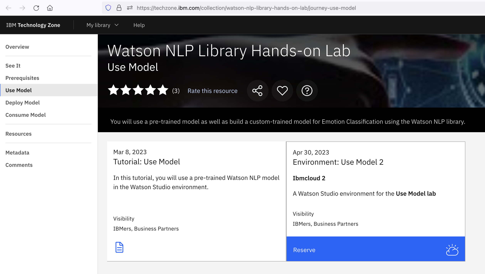
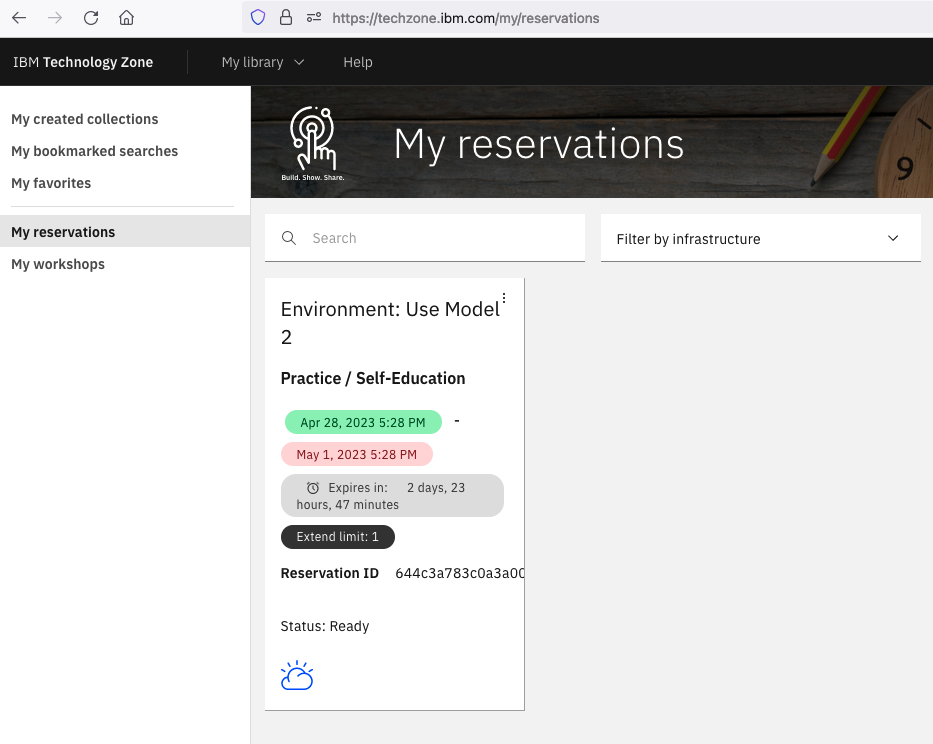

# Embeddable AI

You can access this page via [https://ibm.biz/watson-nlp-for-embed](https://ibm.biz/watson-nlp-for-embed).

## Pre-requisites

* Open landing page [DSCE](https://dsce.ibm.com/),
* Open [https://github.com/IBM/dsce-sample-apps/tree/main/entity-extraction](https://github.com/IBM/dsce-sample-apps/tree/main/entity-extraction),
* Open [http://localhost:8050/](http://localhost:8050/) for local demo,
* Open [IBM Watson Natural Language Processing Library for Embed Trial](https://www.ibm.com/account/reg/us-en/signup?formid=urx-51726),
* Open to edit Jupyter Notebook `Emotion Classification - Custom Model`,
* Check your reservation of Watson Studio sandbox at [https://techzone.ibm.com/collection/watson-nlp-library-hands-on-lab/journey-use-model](https://techzone.ibm.com/collection/watson-nlp-library-hands-on-lab/journey-use-model).

## Introduction

### About Me

...

### Objective

In this demo, I will show how to include advanced AI functionality from IBM Watson in your own applications and use the Watson NLP library for Entities Extraction as an example.

In the example I use a pre-trained model but I will also show how to customize a model to increase accuracy for your specific domain using IBM Watson Studio and re-build a custom image of the Watson NLP.

I use an online wizard (DSCE) to guide anyone through the steps.

### Terms Used

Some terms used:

1. [DSCE](https://dsce.ibm.com/) is `IBM Digital Self-Serve Co-Create Experience (DSCE)`, an IBM wizard that makes it easy to try IBM products like IBM Watson libraries.

2. [IBM TechZone](techzone.ibm.com) makes free POC environments or sandboxes of IBM products available to IBM partners. To access TechZone your IBM Id must be registered in your PartnerPlus account. You must have an IBM PartnerPlus account.

3. `IBM Build Lab` is part of the IBM Ecosystem Engineering organization that helps IBM partners with embedding IBM products in their own product (as part of an ESA agreement) for free.

4. `Embedded AI` refers to the use of AI directly in your own products or IBM products so that you can run your AI applications anywhere, including disconnected on-prem environments, Azure, or AWS.

Other [IBM products use embedded AI](https://dsce.ibm.com/wizard/try?page=build-product):

* Instana,
* Turbonomic,
* Watson Assistant,
* Watson Discovery,
* Maximo,
* Maximo Visual Inspection (MVI),
* etc.

### Agenda

1. Introduction
1. Start with DSCE wizard,
1. Demo: Use a Pre-Trained Model,
1. Get an Entitlement Key and Sign up for Trial
1. Use Watson Studio for Custom Model in TechZone
1. Conclusion

## Start with DSCE

1. Go to [https://dsce.ibm.com/](https://dsce.ibm.com/) to use the DSCE Wizard,
1. Click `Get Started`,

  

1. Select "Find and try AI", click Start,

  

1. Click `Build with AI libraries`,
1. Click `Build with Watson NLP`,
1. Click `Entities extraction`,
1. Click `Library and container`,

So now you are familiar with DSCE, let's look at using a pre-trained model in a demo.

## Demo: Use a Pre-Trained Model

In this section, I will continue in DSCE and run sample Python code embedding Watson NLP with the pre-trained model in a demo.

1. Click `Use a pre-trained model`,
1. Click Next,

  

1. Review he `Try` steps:

  

1. In Step 1, you can review a few use cases: 
    1. entity extraction can be `Voice of the Customer`, a technique used to gather and analyze feedback from customers to improve products, services, and the customer experience. Or,
    1. extract Personal Identifiable Information (PII) for Compliance or Verification,
1. Skip the live demo application in Step 2, because I am running the demo from the application code sample in Step 3,
1. In step 3, get the code for the Entity Extraction demo app at [https://github.com/IBM/dsce-sample-apps/tree/main/entity-extraction](https://github.com/IBM/dsce-sample-apps/tree/main/entity-extraction),

  

1. Run the code for the client demo following the instructions in the Github README,
1. Open the UI at [http://0.0.0.0:8050](http://0.0.0.0:8050),

  

The demo uses a client that accesses the Watson NLP Runtime, which is packaged as a container image hosted on the IBM Entitled Registry. You will need an entitlement key to access it. The demo uses the Watson NLP Runtime deployed on IBM Code Engine, see the client code:

```python
# pre-defined URL for backend
SERVER_URL = 'https://8f96122371.dsceapp.buildlab.cloud'
# API end-points used
REQ_URL = SERVER_URL+'/v1/watson.runtime.nlp.v1/NlpService/EntityMentionsPredict'
```

Now you have seen how you can deploy the Watson NLP Runtime and embed it in your client code. Next, let's look at the required steps to get started using embedded AI in your own solutions.

## Embed AI in your own Solution

In the next section, we will step through the steps to start using the `IBM Watson NLP Library for Embed` in your own solutions.

### Get Entitlement Key and Sign up for Trial

To deploy your own instance of IBM Watson NLP Library for Embed, you first need an Entitlement Key or license. You can sign up for the trial license that allows you to use Watson NLP for 180 days for free.

1. Click the [Deploy](https://dsce.ibm.com/wizard/try/results/embed-nlp-entities-container-pt#deploy) tab,

  

1. Click the [Get trail license and access container](https://www.ibm.com/account/reg/us-en/signup?formid=urx-51726),
1. Sign up for the trial to link the trial license of `IBM Watson NLP Library for Embed` to your `IBM Id`,
1. If you have an IBM Id already, click `Log in` 
1. On the [IBM account](https://www.ibm.com/account/us-en/) page,
1. Click `Manage Products`, which will forward you to [https://myibm.ibm.com/dashboard/](https://myibm.ibm.com/dashboard/),

  

1. Under `Trials`, you should see your trial of `IBM Watson NLP Library for Embed`,
1. Under `Cloud Paks & container software`, you should see a `Container Software & Entitlement Keys` tile,
1. Click `View Library`,
1. You can view existing or create new entitlement keys,

  

All good, we verified that the trial is active and you have an entitlement key. You now could already use the default image for Watson NLP using your entitlement key. The default image will use the pre-trained model and give you out-of-the-box results. But most likely, for a specific use case in a specific domain with specific data, you can increase the accuracy of the Watson NLP algorithms by training a custom model. Training of custom models can be done in environments like Watson Studio.

## Use Watson Studio in TechZone

To train a custom model you can use Watson Studio. [IBM TechZone](techzone.ibm.com) makes free POC environments or sandboxes of IBM products like Watson Studio available to IBM partners.

1. To reserve a Watson Studio environment, follow the instructions in this [TechZone Tutorial](https://github.com/ibm-build-lab/Watson-NLP/blob/main/hands-on-lab/use-model/ML-TZ.md),

## Use a Custom Model

1. Reserve a [Watson Studio environment in TechZone](https://techzone.ibm.com/collection/watson-nlp-library-hands-on-lab/journey-use-model).

  

1. Select Reserve now,

  

1. When filling in the form you can set:

    * Purpose: Practice/Self-Education
    * Purpose description: Hands-on lab
    * Preferred geography: AMERICAS - us-south region - any datacenter

  

1. Check your [Reservations in TechZone](https://techzone.ibm.com/my/reservations), to make sure the Watson Studio sandbox is Ready,

  

1. If the Environment Status is Ready, continue,
1. Login to [https://dataplatform.cloud.ibm.com/home2?context=cpdaas](https://dataplatform.cloud.ibm.com/home2?context=cpdaas)

  

1. In the top right, you should see an active account `2577353 - tsglwatson`, if not, switch the active account,
1. In the Projects tile, you should notice a project named `emotion-classification-[hash]`,
1. Click the emotion classification project to open it,

  

1. You should see 3 assets: `Emotion Classification - Custom Model`, `Emotion Classification - Pre-Trained Model`, and `emotion-tweets.csv`,
1. If you don't see all 3 assets, click the `View all` link in the assets tile or go to the Assets tab,

  

1. Next, create an asset token,
1. Click on the Manage tab.
1. Switch to the `Access control` menu item on the left, then select `Access tokens`,
1. If no token exists yet, click `New access token`,
1. Enter a Name for the access token, and select Editor in the Access role. Then, click Create.
1. Click on the Assets tab, and find the notebook `Emotion Classification - Custom Models`.
1. Click the three dots on the right to open a drop-down menu, select Edit,

  

1. Your notebook will load,

  

1. Once your notebook has loaded, in the top right of the horizontal tool bar, click the 3 dots dropdown, and select Insert project token,

  

1. You should see the token been inserted at the top of your notebook,

  

You're all set! You are now ready to customize your model and edit the notebook. After you edited your notebook, you only need to rebuild your container image with the custom model for Watson NLP and redeploy it.

## Build Custom Model Image

Instead of using the pre-trained model, you can also use the customized model and build the container image for deployment with the custom model. Follow the instructions at [Build the custom model container](https://dsce.ibm.com/wizard/deploy/results/nlp-build-ct#try).

1. There is a boilerplate code for your custom model container,

```dockerfile
# Watson Studio
project.save_data('ensemble_model', data=ensemble_model.as_file_like_object(), overwrite=True)

# Dockerfile
ARG WATSON_RUNTIME_BASE="wcp-ai-foundation-team-docker-virtual.artifactory.swg-devops.com/watson-nlp-runtime:1.0.0"
FROM ${WATSON_RUNTIME_BASE} as base
ENV LOCAL_MODELS_DIR=/app/models
COPY models /app/models

docker build . -t watson-nlp-custom-container:v1 
```

That concludes this demo.

## Work with IBM Build Lab

If you have any questions or want to work on your solution with us 1-on-1, you can contact us via the [DSCE site](https://dsce.ibm.com/).

  

1. In the top-right, click `Contact Us`,

  

1. To learn more about embeddable AI using Watson NLP see the Assets for Watson NLP by Build Lab at [https://github.com/ibm-build-lab/Watson-NLP](https://github.com/ibm-build-lab/Watson-NLP).
